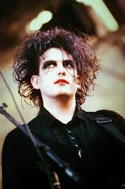
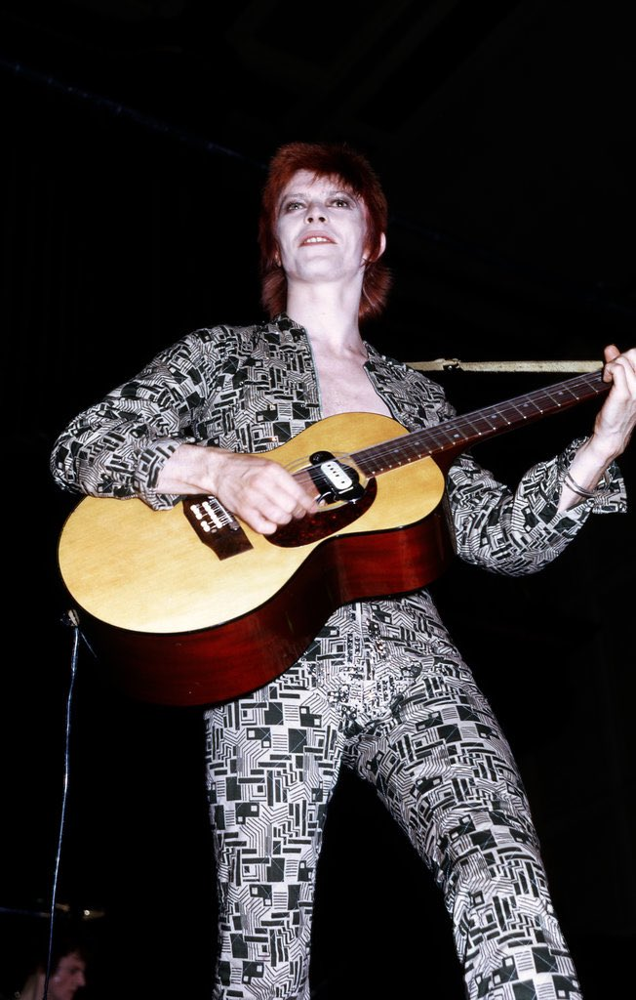
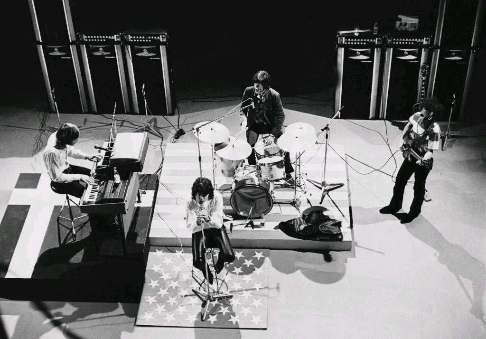
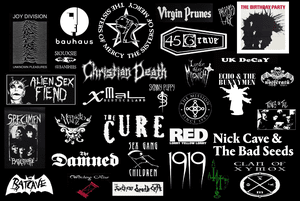

# ELIZAVETA_KUORTTI.github.io
<!DOCTYPE html>
<html>
  <head>
    <link rel="stylesheet" href="style.css">
  </head>
  <body>
    

    <h1>Ghotic rock</h1>
    <h2>main information </h2>
  
    

    <h3>Definition</h3>
    
<b style="font-size: 20px">Gothic rock</b> <b>(also called goth rock or simply goth)</b> is a style of rock music that emerged from post-punk in the United Kingdom in the late 1970s. The first post-punk bands which shifted toward dark music with gothic overtones include Siouxsie and the Banshees, Joy Division, Bauhaus, and the Cure.

    <h3>Characteristics</h3>
    
    
Robert Smith, source: Music Daily

    
The genre itself was defined as a separate movement from post-punk. Gothic rock stood out due to its darker sound, with the use of primarily minor or bass chords, reverb, dark arrangements, or dramatic and melancholic melodies, having inspirations in gothic literature allied with themes such as sadness, nihilism, dark romanticism, tragedy, melancholy and morbidity. These themes are often approached poetically. The sensibilities of the genre led the lyrics to represent the evil of the century and the romantic idealization of death and the supernatural imagination. Gothic rock then gave rise to a broader goth subculture that included clubs, fashion and publications in the 1980s, 1990s, and into the 21st century.

    
    
David Bowie, by Rick Walton

    
Gothic rock typically deals with dark themes addressed through lyrics and the music's atmosphere. The poetic sensibilities of the genre led gothic rock lyrics to exhibit literary romanticism, morbidity, existentialism, religious symbolism, or supernatural mysticism. Gothic rock is an offshoot of post-punk and, according to AllMusic, "took the cold synthesizers and processed guitars of post-punk and used them to construct foreboding, sorrowful, often epic soundscapes." Early gothic rock had introspective or personal lyrics, but according to AllMusic, "its poetic sensibilities soon led to a taste for literary romanticism, morbidity, religious symbolism, and/or supernatural mysticism."

    <h3>Forerunners (1960s and 1970s)</h3>
    
    
The Doors, concert in Copenhagen, by Jan Persson, 1967

    
Critic John Stickney used the term "gothic rock" to describe the music of the Doors in October 1967, in a review published in The Williams Record. Stickney wrote that the band met the journalists "in the gloomy vaulted wine cellar of the Delmonico hotel, the perfect room to honor the gothic rock of the Doors".
    Musicians who initially shaped the aesthetics and musical conventions of gothic rock include Marc Bolan, the Velvet Underground, the Doors, David Bowie, Brian Eno, and Iggy Pop.

    

    <h3>Here is the list of the most popular Gothic rock bands:</h3>
      
      
gothic bands logos: 

    <ul>
      <li>Ausgang</li>
      <li>Bauhaus</li>
      <li>The Cure</li>
      <li>Evanescence</li>
      <li>Ghost Dance</li>
      <li>Joy Division</li>
      <li> Lacrimosa</li>
      <li>The Sisters of Mercy</li>
    </ul> 
    

  </body>
</html>
